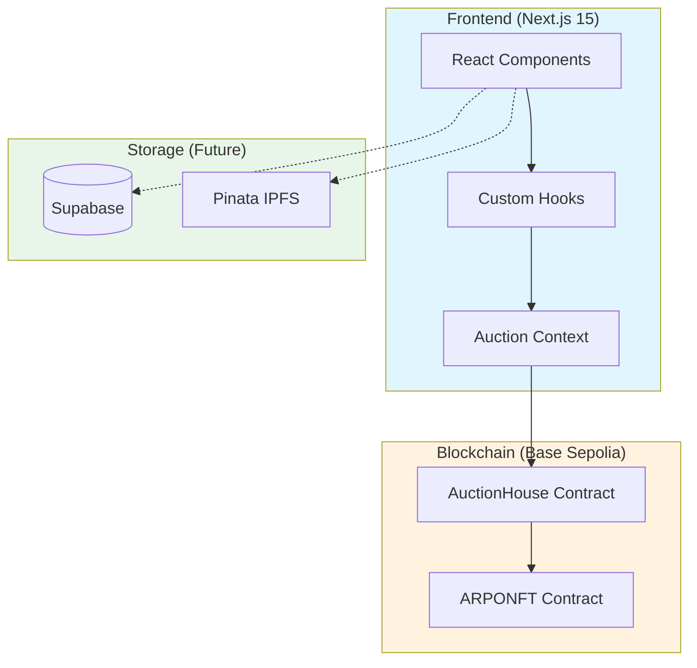
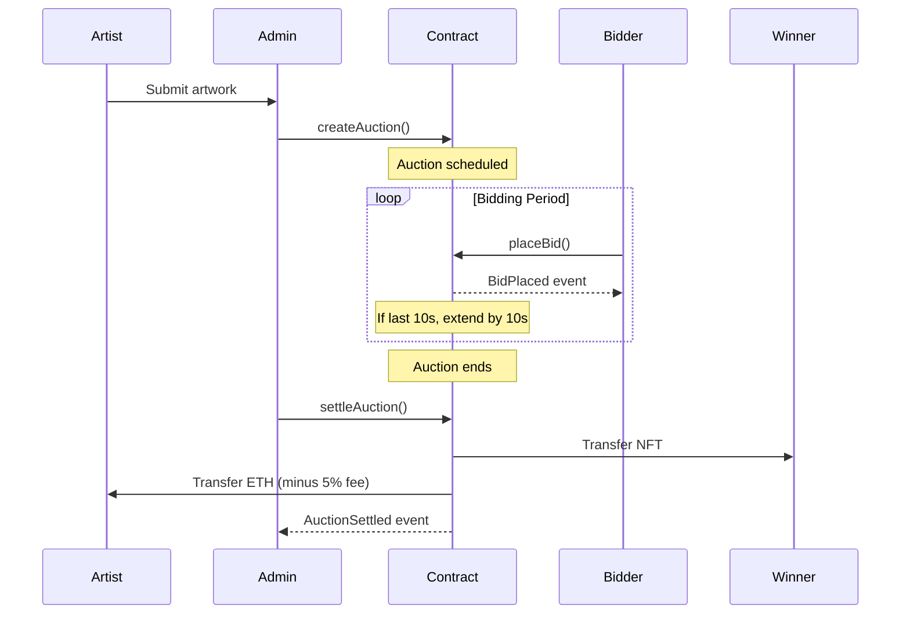

# ARPO Studio - Developer Documentation

A premium on-chain NFT auction platform built with Next.js 15, designed for Base Sepolia testnet deployment.

---

## 🏗️ System Architecture



---

## 📁 Project Structure

```
/ARPOSTUDIO AUTIONHOUSE FINAL
│
├── app/                          # Next.js App Router
│   ├── page.tsx                  # Main auction page (THE core file)
│   ├── admin-panel.tsx           # Admin: mint, analytics, chat mgmt
│   ├── layout.tsx                # Root layout with providers
│   ├── globals.css               # Global styles
│   └── [route]/page.tsx          # Static pages (team, why, etc.)
│
├── components/                   # React Components
│   ├── ui/                       # shadcn/ui primitives (50 files)
│   │   ├── button.tsx
│   │   ├── card.tsx
│   │   ├── input.tsx
│   │   └── ...
│   │
│   ├── auction-chat.tsx          # Live chat with @mentions
│   ├── chat-button.tsx           # Chat trigger button
│   ├── auction-ending-banner.tsx # Countdown + confetti + winner modal
│   ├── user-profile-modal.tsx    # Create/edit profile
│   ├── user-profile-page.tsx     # View user profile
│   ├── search-modal.tsx          # Search users/auctions
│   ├── mention-input.tsx         # @mention autocomplete
│   ├── reminder-modal.tsx        # Auction reminders
│   ├── wallet-connect-modal.tsx  # Wallet connection
│   ├── demo-charts.tsx           # Analytics charts
│   └── ...
│
├── contracts/                    # Solidity Smart Contracts
│   └── AuctionHouse.sol          # ARPONFT + ARPOAuctionHouse
│
├── hooks/                        # Custom React Hooks
│   ├── use-auction-state.ts      # Auction state management
│   ├── use-user-profile.ts       # Profile CRUD (localStorage)
│   ├── use-chat-pinned.ts        # Chat position state
│   ├── use-client-auctions.ts    # Auction data fetching
│   └── use-toast.ts              # Toast notifications
│
├── lib/                          # Utilities & Business Logic
│   ├── contracts.ts              # ethers.js contract helpers
│   ├── onchain.ts                # On-chain bid submission
│   ├── auction-data.ts           # Auction scheduling logic
│   ├── schema.sql                # Supabase database schema
│   └── utils.ts                  # General helpers
│
├── types/                        # TypeScript Types
│   └── accepted-token.ts         # Token configuration
│
├── Audit strats/                 # 70 flow map files for auditing
│
└── public/                       # Static assets
```

---

## 🔄 Auction Flow



---

## 💡 Key Concepts

### On-Chain Only Bidding

All bids are blockchain transactions. There is **no platform wallet** - users bid directly from their connected wallet.

```typescript
// lib/contracts.ts
async function placeBidOnChain(auctionId: number, bidAmount: string) {
  const signer = await getSigner()
  const contract = getAuctionHouseContract(signer)
  const tx = await contract.placeBid(auctionId, {
    value: ethers.utils.parseEther(bidAmount),
  })
  return tx
}
```

### Anti-Sniping Mechanism

Bids in the final 10 seconds extend the auction by 10 more seconds:

```solidity
// contracts/AuctionHouse.sol
if (auction.endTime - block.timestamp <= 10 seconds) {
    auction.endTime += 10 seconds;
    emit BidPlaced(auctionId, msg.sender, msg.value, true); // extended = true
}
```

### Bid Increments

- **Minimum bid**: 1% above current bid
- **Maximum bid** (final 10s): 10% above current bid

### Refunds

When outbid, funds are held in the contract. Users can claim via:

```typescript
await contract.claimRefund()
```

---

## 🗄️ Data Strategy

### Real-Time Data (Blockchain)

| Data | Source | Why |
|------|--------|-----|
| Current bid | Contract.getAuction() | Must be accurate |
| Highest bidder | Contract.getAuction() | Immutable |
| End time | Contract.getAuctionEndTime() | May extend |
| Settlement status | Contract.getAuction().settled | On-chain proof |

### Historical Data (Supabase - Future)

| Data | Source | Why |
|------|--------|-----|
| Past auction history | Database | Fast queries |
| User stats | Database | Aggregated |
| Chat messages | Database | Persistent |
| User profiles | Database | Editable |

### Current Demo Mode

Uses `localStorage` for:
- User profiles (`arpo_users`)
- Display names (`displayName_${wallet}`)

---

## 🧩 Component Hierarchy

```
AuctionSite (page.tsx)
├── Header
│   ├── Logo
│   ├── Navigation (Menu, Why, Team, etc.)
│   ├── Theme Toggle
│   ├── Search Button → SearchModal
│   └── Connect Wallet → WalletConnectModal
│
├── Main Content
│   ├── NFT Image Display
│   ├── Auction Info (Price, Time, Bidder)
│   ├── Bid Buttons
│   │   ├── Min Bid (1%)
│   │   └── Max Bid (10%)
│   └── Related Info
│
├── Floating Elements
│   ├── ChatButton → AuctionChat
│   ├── AuctionEndingBanner (final 10s)
│   └── Notifications
│
└── Modals
    ├── UserProfileModal
    ├── SettingsModal (Notifications, Theme, Profile)
    ├── TransactionModal (Bid confirm/status)
    ├── MintFlowModal (Admin mint wizard)
    ├── AdminPanel
    ├── ReminderModal
    └── Various Pages (Team, Why, etc.)
```

---

## ⚙️ State Management

### Auction Context (`auction-context.tsx`)

```typescript
interface AuctionState {
  currentBid: number
  highestBidder: string | null
  launchPrice: number
  bidCount: number
}

const { auctionState, placeBid, getMinBid, getMaxBid } = useAuction()
```

### User Profile Hook (`use-user-profile.ts`)

```typescript
const {
  userProfile,       // Current user's profile
  saveProfile,       // Save profile to storage
  getDisplayName,    // username > wallet shorthand
  showProfileModal,  // Trigger profile creation
  isFirstTimeUser,   // First-time visitor
} = useUserProfile(connectedWallet)
```

### Notifications & Settings (`use-notifications.ts`)

```typescript
const {
  permission,        // Browser permission status
  soundEnabled,      // Audio toggle state
  requestPermission, // Prompt user
  notifyBidPlaced,   // Trigger bid notification
} = useNotifications()
```

---

## 🚀 Getting Started

### Prerequisites

- Node.js 18+
- MetaMask or compatible wallet
- Base Sepolia testnet ETH

### Installation

```bash
# Install dependencies
npm install

# Start dev server
npm run dev

# Build for production
npm run build
```

### Environment Variables

```env
# Required
NEXT_PUBLIC_CHAIN_ID=84532
NEXT_PUBLIC_RPC_URL=https://sepolia.base.org
NEXT_PUBLIC_ADMIN_WALLET=0xYourAddress

# After contract deployment
NEXT_PUBLIC_AUCTION_HOUSE_CONTRACT=0x...
NEXT_PUBLIC_NFT_CONTRACT=0x...
```

---

## 📜 Smart Contracts

### ARPONFT (ERC-721)

```solidity
contract ARPONFT is ERC721URIStorage, Ownable {
    function mint(address to, address artist, string metadataURI) external onlyAuctionHouse returns (uint256)
    function getArtist(uint256 tokenId) external view returns (address)
}
```

### ARPOAuctionHouse

```solidity
contract ARPOAuctionHouse is ReentrancyGuard, Ownable, Pausable {
    function createAuction(...) external onlyOwner returns (uint256)
    function placeBid(uint256 auctionId) external payable
    function settleAuction(uint256 auctionId) external
    function claimRefund() external
}
```

See `contracts/AuctionHouse.sol` for full implementation.

---

## 🧪 Testing

### Local Development

```bash
npm run dev
# Open http://localhost:3000

# Use "Demo: Connect as Admin" for admin panel
```

### Build Verification

```bash
npm run build && npm start
```

### Type Checking

```bash
npx tsc --noEmit
```

---

## 📝 Key Files Quick Reference

| What | Where |
|------|-------|
| Main page logic | `app/page.tsx` |
| Admin panel | `app/admin-panel.tsx` |
| Bidding logic | `lib/onchain.ts` |
| Contract helpers | `lib/contracts.ts` |
| Smart contracts | `contracts/AuctionHouse.sol` |
| Auction state | `hooks/use-auction-state.ts` |
| User profiles | `hooks/use-user-profile.ts` |
| Chat component | `components/auction-chat.tsx` |
| DB schema | `lib/schema.sql` |

---

## 🔗 Resources

- [Base Sepolia Faucet](https://www.coinbase.com/faucets/base-ethereum-sepolia-faucet)
- [Basescan Sepolia](https://sepolia.basescan.org)
- [ethers.js v5 Docs](https://docs.ethers.io/v5/)
- [Next.js Docs](https://nextjs.org/docs)

---

Built with ❤️ by ARPO Studio